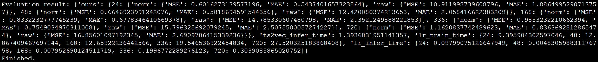

### 【论文复现赛】 TS2Vec: Towards Universal Representation of Time Series

* 队伍名称：Anya Waku Waku

#### 目录

* 一、论文简介

* 二、复现指标符合情况

* 三、数据集

* 四、环境依赖

* 五、快速开始


本项目基于PaddlePaddle框架复现TS2Vec(https://arxiv.org/abs/2106.10466) 。


#### 一、论文简介

#### 1.1 方法
本论文首先回顾了当前时序表征学习的几个问题：
1. 大部分研究进行的是实例级别的表征（instance-level representations），但实例级表示可能不适合需要细粒度表示的任务。 
2. 很少有方法在不同粒度上区分多尺度上下文信息
3. 目前大多数时间序列表示方法的灵感来自 CV 和 NLP 领域的经验，这些领域具有很强的归纳偏差，例如转换不变性和裁剪不变性。然而，这些假设并不总是适用于建模时间序列。例如，裁剪是一种常用的图像增强策略。然而，时间序列的分布和语义可能会随着时间的推移而变化，裁剪后的子序列可能与原始时间序列有不同的分布

为了解决上述问题，作者提出了一种在任意语义级别学习时间序列表征的通用框架，与SOTA对比，TS2Vec可以在所有语义级别上进行时间序列的表示学习，它在实例和时间维度上分层区分正样本和负样本；对于任意子序列，其总体表示可以通过相应时间戳上的最大池来获得。这使模型能够捕获时间数据的多分辨率上下文信息，并为任何粒度生成细粒度表示。此外，TS2Vec 中的对比目标基于增强的上下文视图，即两个增强上下文中相同子系列的表示应该是一致的。通过这种方式，我们为每个子系列获得了强大的上下文表示，而不会引入未意识到的归纳偏差，如变换和裁剪不变性。


#### 二、复现指标符合情况
* 原论文 Table 7

  

  * Paddle实现结果 (ETTh1)
  

  * Paddle实现结果 (ETTh2)
  

  * Paddle实现结果 (ETTm1)
  

  * Paddle实现结果 (Electricity)

* 原论文 Table 8

  

  * Paddle实现结果 (ETTh1)
  

  * Paddle实现结果 (ETTh2)
  

  * Paddle实现结果 (ETTm1)
  

  * Paddle实现结果 (Electricity)


#### 三、数据集
数据集使用了原作者repo (https://github.com/yuezhihan/ts2vec) 提供的方法下载，经处理后直接放在了目录datasets下。目录datasets包含了ETTh1, ETTh2, ETTm1,electricity数据集。

#### 四、环境依赖
* 硬件：GPU\CPU
* 框架：PaddlePaddle 2.3.1


#### 五、快速开始

**step1：克隆本项目**
```python
git clone https://github.com/kafaichan/paddle-ts2vec.git
```

**step2：训练模型**
```python
cd paddle-ts2vec

# Table 7 Etth1
python -u train.py ETTh1 forecast_univar --loader forecast_csv_univar --repr-dims 320 --eval

# Table 7 Etth2
python -u train.py ETTh2 forecast_univar --loader forecast_csv_univar --repr-dims 320 --eval

# Table 7 Ettm1
python -u train.py ETTm1 forecast_univar --loader forecast_csv_univar --repr-dims 320 --eval

# Table 7 electricity
python -u train.py electricity forecast_univar --loader forecast_csv_univar --repr-dims 320 --eval


# Table 8 Etth1
python -u train.py ETTh1 forecast --loader forecast_csv --repr-dims 320 --eval

# Table 8 Etth2
python -u train.py ETTh2 forecast --loader forecast_csv --repr-dims 320 --eval

# Table 8 Ettm1
python -u train.py ETTm1 forecast --loader forecast_csv --repr-dims 320 --eval

# Table 8 electricity
python -u train.py electricity forecast --loader forecast_csv --repr-dims 320 --eval
```


#### 六 引用
本项目的代码主要来源于此repo (https://github.com/yuezhihan/ts2vec)